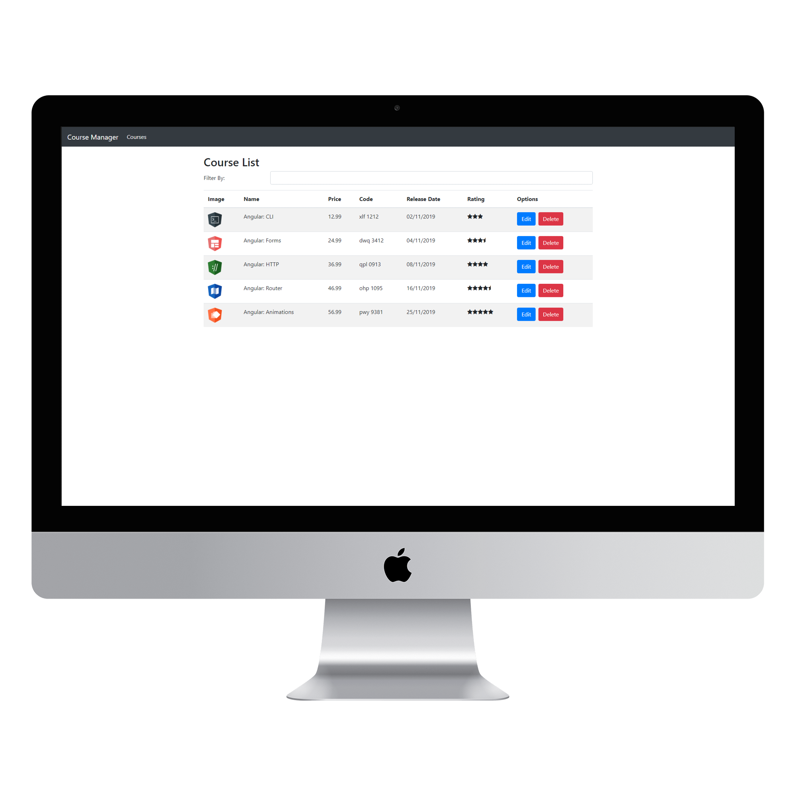

<h2 align="center">
  Course Manager
</h2>

# 💻 Angular-Filmes

> Projeto feito no bootcamp da Digital Innovation One.

## 📷 Imagens

> Lista

 
    

> Edição

 
    

# CourseManager

O projeto foi feito com [Angular CLI](https://github.com/angular/angular-cli) version 8.3.21.

Entre no projeto e instale as dependencias `npm install`

## Servidor Angular

Execute `ng serve` Para iniciar o servidor. Navegue para `http://localhost:4200/`. O aplicativo vai recarregar automaticamente ao fazer alterações no código.

## Servidor BackEnd

https://github.com/LuizPedroSM/course-manager-server
